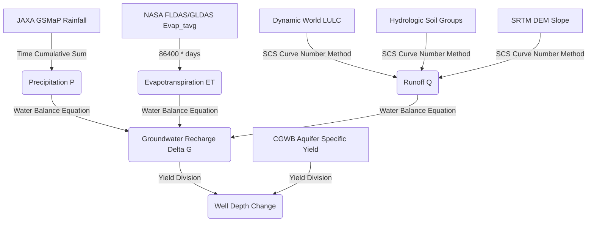

# Scientific Models in CoRE Stack (Raw Data ➔ Outputs ➔ Decisions)

This document provides a summary of the scientific models implemented in the CoRE Stack backend. It traces the transition from **Raw Remote Sensing/Geospatial Data** to **Output Hydro-geological Variables**, and finally to **NRM Decisions & Actions**.

---

## 1. Water Balance Model (Hydrology)

Calculates the spatial and temporal water availability within individual Microwatersheds (MWS) using Google Earth Engine.

### Pipeline: Raw Data ➔ Output Variables

### Key Equations & Scientific Methods

#### A. Precipitation ($P$)

* **Raw Source**: `JAXA/GPM_L3/GSMaP/v6/operational` (hourly precipitation rate).
* **Processing**: Converts hourly rates to cumulative precipitation ($mm$) over the fortnight or hydrological year.
* **Output**: Mean precipitation ($P$) per MWS.

#### B. Evapotranspiration ($ET$)

* **Raw Source**: NASA `FLDAS` or `GLDAS` (`Evap_tavg` in $kg/m^2/s$).
* **Processing**: Multiplies by $86400$ to convert to $mm/day$, then aggregates over the target period.
* **Output**: Mean Evapotranspiration ($ET$) per MWS.

#### C. Runoff ($Q$)

* **Raw Sources**: Hydrologic Soil Groups (A, B, C, D), SRTM DEM (slope), Dynamic World 10m LULC.
* **Processing**: **Slope-adjusted SCS-CN (Soil Conservation Service Curve Number) Method**.
  1. Combines soil type and land cover to determine base Curve Number ($CN_2$).
  2. Adjusts $CN_2$ for slope using SRTM DEM to get $CN_{2a}$.
  3. Calculates dry ($CN_{1a}$) and wet ($CN_{3a}$) soil moisture thresholds.
  4. Looks at antecedent precipitation ($P_5$, previous 5 days rainfall) to select the appropriate Curve Number:
     * $P_5 < 35 \text{ mm} \rightarrow$ Dry Condition ($CN_{1a}$)
     * $35 \text{ mm} \le P_5 \le 52.5 \text{ mm} \rightarrow$ Normal Condition ($CN_{2a}$)
     * $P_5 > 52.5 \text{ mm} \rightarrow$ Wet Condition ($CN_{3a}$)
  5. Computes daily runoff:
     $$Q = \frac{(P - I_a)^2}{P - I_a + S} \quad \text{where } I_a = 0.2S \text{ and } S = \frac{25400}{CN} - 254$$
  6. Accumulates daily runoffs and divides by watershed area.
* **Output**: Runoff ($Q$) in $mm$ per MWS.

#### D. Groundwater Recharge ($\Delta G$)

* **Equation**:
  $$\Delta G = P - Q - ET$$
* **Output**: Net change in groundwater storage ($\Delta G$) in $mm$.

#### E. Change in Well Depth ($wd$)

* **Processing**: Resolves specific yield ($S_y$) by intersecting microwatershed polygons with CGWB Principal Aquifer maps.
* **Equation**:
  $$wd = \frac{\Delta G}{S_y \times 1000}$$
* **Output**: Predicted annual water table level fluctuation (change in well depth) in meters.

---

## 2. Composite Drought Assessment

Determines meteorological and agricultural drought severity to guide crop planning and relief allocation.

### Indicators Checked

1. **Rainfall Deviation (CHIRPS)**: Fortnightly/monthly rainfall deviation from long-term historical mean (since 1981).
2. **Dry Spells (CHIRPS)**: Number of consecutive weeks with rainfall deviation $\le -50\%$.
3. **SPI-1 (Standardized Precipitation Index)**: Monthly deviation of current rainfall standardized against historical mean & standard deviation.
4. **Vegetation Condition Index (VCI)**: Normalizes MODIS NDVI over a historical baseline (since 2000) specifically inside crop zones:
   $$VCI = \frac{NDVI - NDVI_{min}}{NDVI_{max} - NDVI_{min}} \times 100$$
5. **Moisture Adequacy Index (MAI)**: Ratio of actual ET to Potential ET (PET) using MODIS.
6. **Percent Area Cropped (PAS)**: Ratio of crop area currently sown to historical crop-sown baseline (obtained from multitemporal LULC classifications).

### Decision Table for Drought Classification

* **Trigger condition**: Meteorological Drought ($MD$) must be active (triggered by low SPI / high Rainfall Deviation + Dry spells).
* **Severity Classes**:
  * **Severe (Class 3)**: If 3 agricultural indicators (VCI $\le 40\%$, MAI $\le 25\%$, PAS $\le 33.3\%$) denote severe conditions.
  * **Moderate (Class 2)**: If $\ge 2$ indicators denote moderate conditions (VCI $\le 60\%$, MAI $\le 50\%$, PAS $\le 50\%$).
  * **Mild (Class 1)**: All other triggered scenarios.
  * **Normal (Class 0)**: No meteorological trigger.

---

## 3. CLART (Composite Land Assessment & Restoration Tool)

Generates spatial raster layers directing where to place water recharge structures and land treatments.

### Decision Matrix (Lithology, Slope, Drainage, Lineaments)

* **Inputs**:
  * **Lithology (Rock type)**: Aquifer/rock permeabilities.
  * **Drainage Density ($dd$)**: Stream concentration (classified into Low, Medium, High).
  * **Lineaments ($lin$)**: Structural fractures (fracture zones have score 10; others 1).
  * **Slope ($sp$)**: Expressed as a percentage of maximum slope.
  
* **Calculated Recharge Potential ($rp$)**:
  $$rp = dd\_score \times lin\_score \times lith\_score$$
  High Recharge Potential: $rp \in \{1, 2, 10, 20, 30, 40, 60, 90\}$

### Output Actions & Decisions

| Class | Scientific Condition | Recommended NRM Structure / Action |
|---|---|---|
| **Class 1** | High Recharge ($rp=1$) & Flat Slope ($\le 20\%$ of max) | **Groundwater Recharge Structures** (Check dams, percolation tanks, recharge wells) |
| **Class 2** | Medium Recharge ($rp=2$) & Low-to-Med Slope ($\le 25\%$) | **Surface Water Harvesting/Storage** (Farm ponds, irrigation storage tanks) |
| **Class 3** | Low Recharge ($rp=3$) & Flat Slope ($\le 20\%$ of max) | **Vegetative & Biological Measures** (Afforestation, grass strips, crop covers) |
| **Class 4** | Any Recharge potential ($rp \in \{1,2,3\}$) & Steep Slope ($25\% - 30\%$) | **Contour Trenches / Continuous Bunding** (Trenches dug along slope contours to slow down runoff) |
| **Class 5** | Any Recharge potential ($rp \in \{1,2,3\}$) & Very Steep Slope ($> 30\%$) | **Boulder Checks / Gully Plugs** (Physical barriers in erosion gullies to control soil erosion) |
