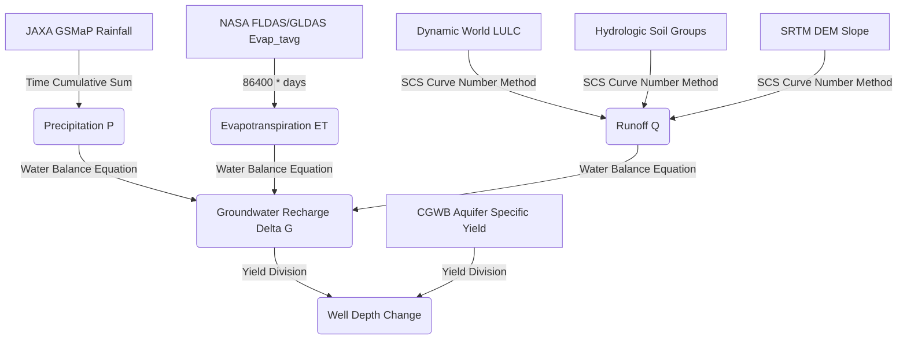

# Hydrological Water Balance Model: Data-to-Decision Flow

The diagram below represents the scientific pipeline used in the CoRE Stack backend to calculate groundwater recharge and predict water table fluctuations.

---

## 🔍 Section 1: Detailed Flowchart Explanation

### 1. Precipitation ($P$) Calculation
* **Raw Input**: JAXA GSMaP (Global Satellite Mapping of Precipitation) dataset, which provides hourly rain rates.
* **Process**: The system extracts pixel-level hourly values and performs a **Time Cumulative Sum** over the selected time range (either 14-day fortnights or a full 365-day hydrological year).
* **Output Variable**: Total spatial Precipitation ($P$) in millimeters ($mm$) per microwatershed.

### 2. Evapotranspiration ($ET$) Calculation
* **Raw Input**: NASA FLDAS/GLDAS land data assimilation models, utilizing the average evapotranspiration rate (`Evap_tavg`) in $kg/m^2/s$.
* **Process**: Rates are converted to daily depths ($1 \text{ kg/m}^2 \approx 1\text{ mm}$ of water height) by multiplying by $86400$ seconds/day and the number of days in the period.
* **Output Variable**: Cumulative Evapotranspiration ($ET$) in millimeters ($mm$).

### 3. Runoff ($Q$) Calculation
* **Raw Inputs**: 
  * **Dynamic World LULC**: 10-meter land cover classifications (crops, grass, trees, bare land, built-up).
  * **Hydrologic Soil Groups**: Regional soil drainage classifications (A, B, C, D).
  * **SRTM DEM**: Digital elevation slopes.
* **Process**: **Slope-Adjusted SCS Curve Number Method**. Base curve numbers ($CN$) derived from soil-LULC intersections are mathematically adjusted for steepness using DEM slopes, then factored against a 5-day antecedent precipitation index (soil wetness).
* **Output Variable**: Cumulative Surface Runoff ($Q$) in millimeters ($mm$).

### 4. Groundwater Recharge ($\Delta G$)
* **Inputs**: Computed $P$, $ET$, and $Q$.
* **Process**: **Hydrological Water Balance Equation**:
  $$\Delta G = P - Q - ET$$
* **Output Variable**: Net change in groundwater storage ($\Delta G$) in millimeters ($mm$).

### 5. Well Depth Change
* **Inputs**: $\Delta G$ and CGWB (Central Ground Water Board) Principal Aquifer maps.
* **Process**: **Yield Division**. The specific yield fraction ($S_y$) represents the ratio of water an aquifer releases from storage. The change in recharge depth is divided by specific yield and scaled to meters:
  $$\text{Well Depth Change (m)} = \frac{\Delta G}{S_y \times 1000}$$
* **Output Decision Metric**: Vertical fluctuation of the local water table (well depth change) in meters.

---

## 📊 Section 2: Presentation Points (PPT Slide Ready)

### Slide 1: The Core Water Balance Equation
* **The Pipeline**: Connects remote sensing observations to subterranean aquifer measurements.
* **Core Equation**: $\Delta G = P - Q - ET$.
* **Impact**: Moves NRM planning from guess-work to pixel-by-pixel mathematical models.

### Slide 2: Satellite-Driven Input Variables ($P$ & $ET$)
* **Precipitation ($P$)**: Derived from JAXA GSMaP satellite rain rates, integrated cumulatively to capture local rainfall frequency and intensity.
* **Evapotranspiration ($ET$)**: Derived from NASA FLDAS/GLDAS assimilation systems, accounting for vegetative transpiration and soil evaporation.

### Slide 3: Slope-Adjusted Runoff Modeling ($Q$)
* **Topography + Vegetation**: Intersects SRTM DEM elevation slopes with 10m Dynamic World LULC maps.
* **Soil Permeability**: factors Hydrologic Soil Groups (A, B, C, D) to map the land's natural absorption limits.
* **Dynamic Curve Numbers**: Curve numbers ($CN$) dynamically adjust for slope steepness and antecedent soil moisture.

### Slide 4: Translating Recharge to Well Depth Fluctuations
* **Aquifer Specific Yield ($S_y$)**: Intersects geological aquifer polygon attributes with microwatershed geometries.
* **Yield Scaling**: Dividends water storage height ($\Delta G$) by aquifer porosity/yield values ($S_y$) to project the vertical movement of the water table.
* **Actionable Variable**: Calculates change in local well depths in meters to evaluate groundwater replenishment.
